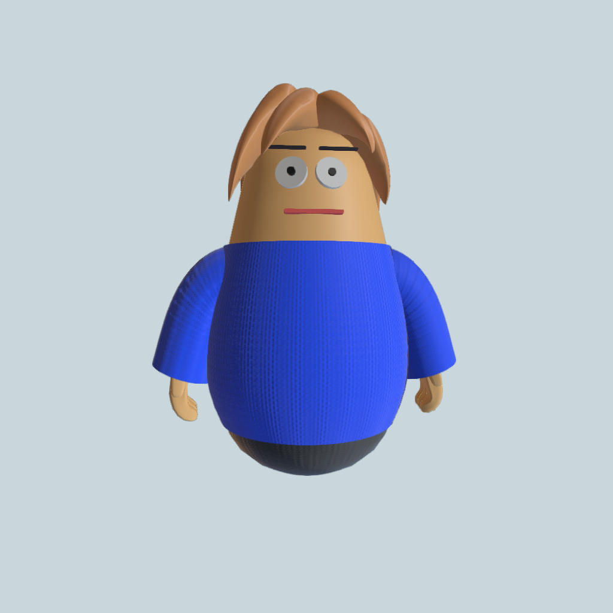
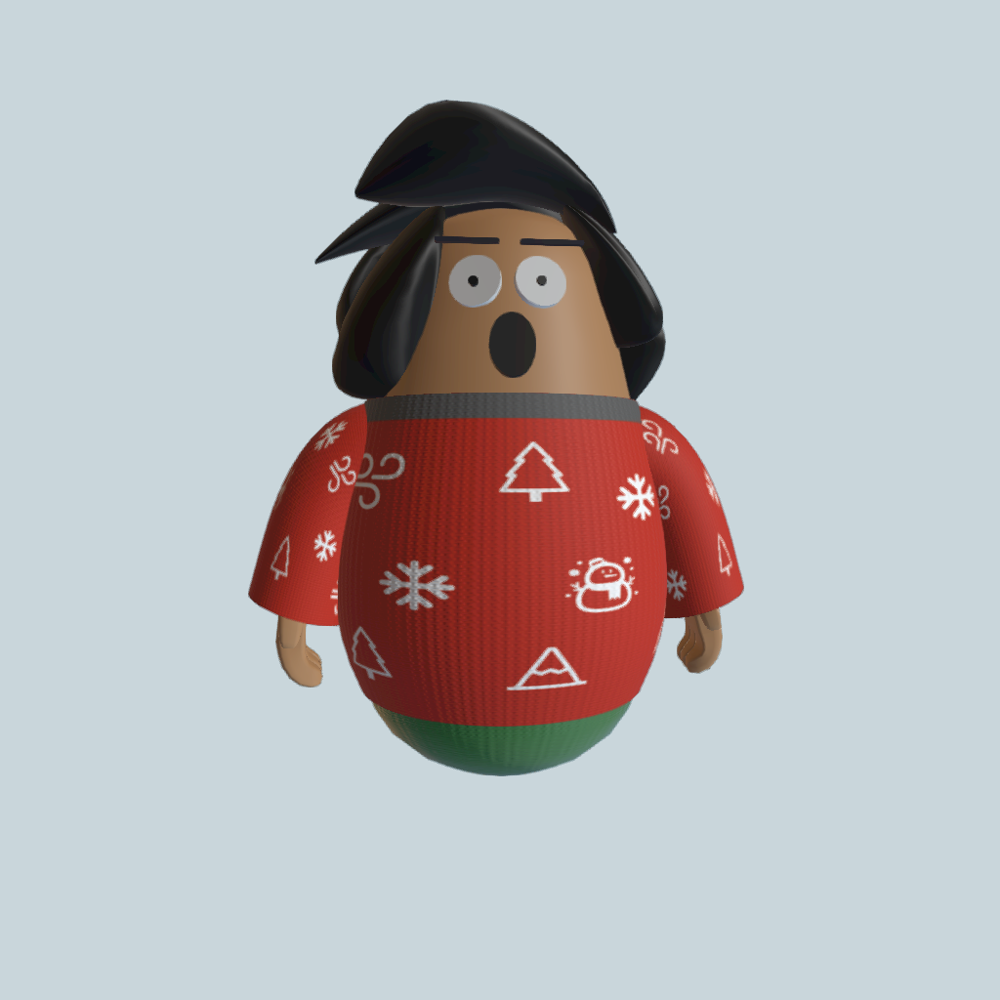
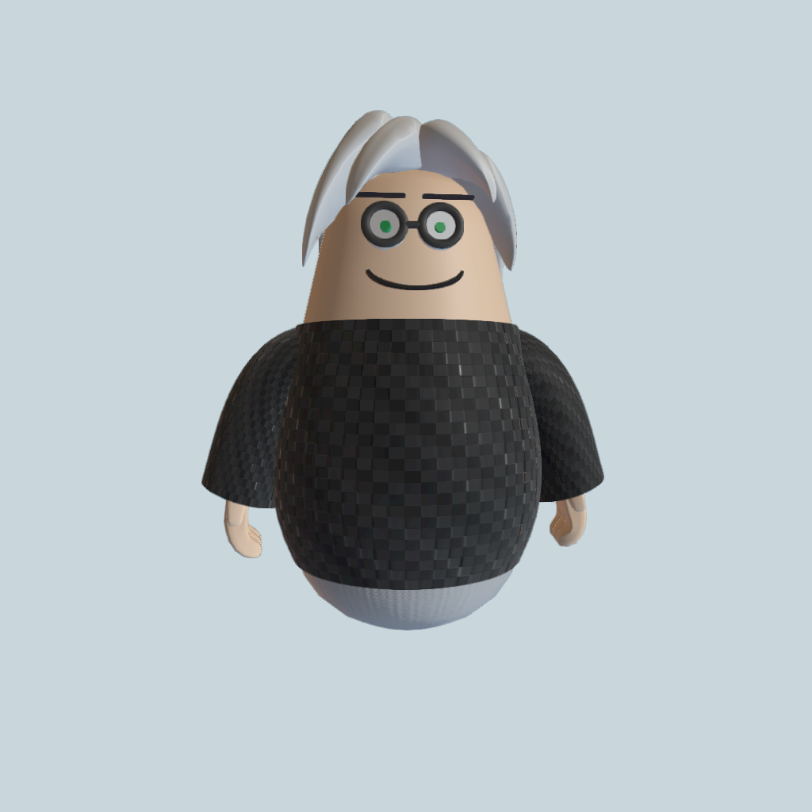
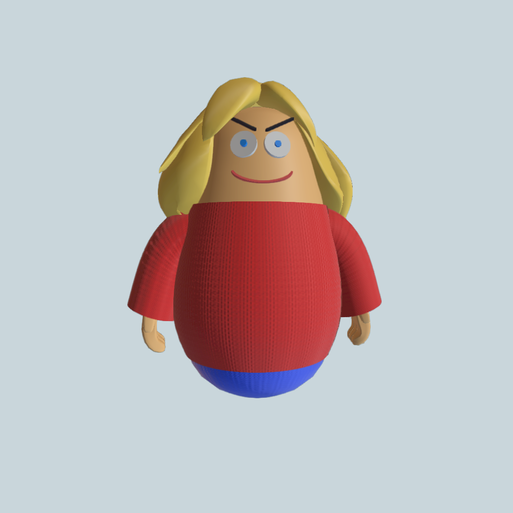
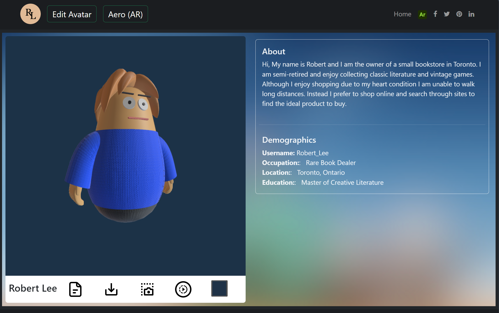
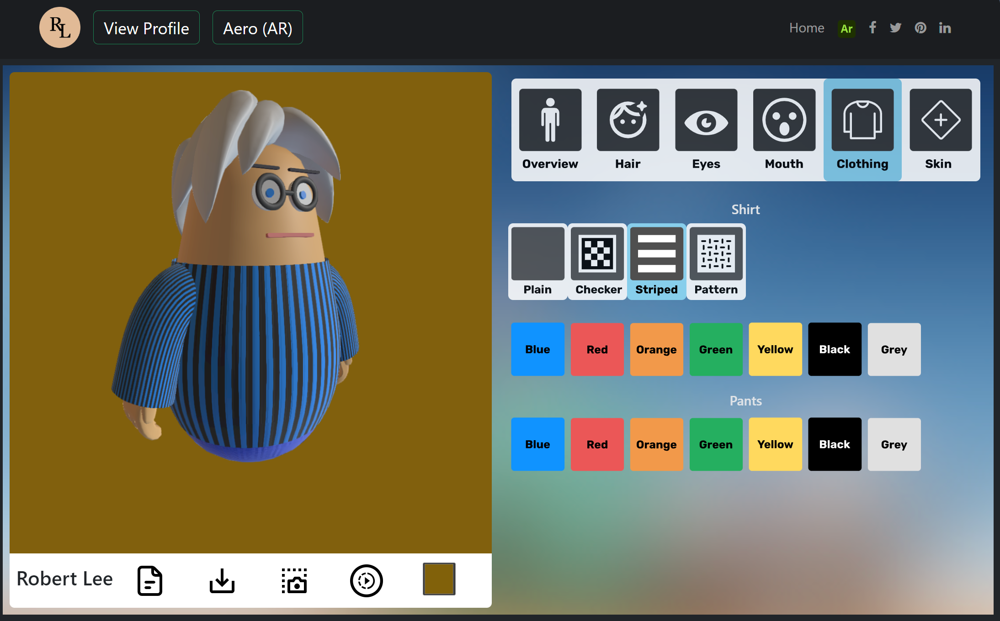

<!--Start-->
## Avatar Customization

### Introduction

| | | | |
|-|-|-|-|
|  |  |  |  |
|||||

3d avatars are increasingly used for platforms such as social media, virtual assistants, and digital worlds. They provide a digital representation, allowing for immersive experiences for users.

The primary goal of this project is to create avatars that represent different users within a shopping application. This is achieved by providing a variety of customization options which can be dynamically changed over time. This provides users with the ability to create their own personal brand through the avatars created.

* Further details for this project can be found **[here](https://matthewkwok.myportfolio.com/digital-avatar-project).**
* The <a href="https://guannan-kwok.github.io/assetLibrary/">Asset Library</a> describes the components of the avatar. 

### Web Editor

The web based editor is available <a href="./avatar_site/index.html">here. Examples snapshots of the editor are shown below.

| | |
|:-------------------------:|:-------------------------:|
|   |  |

</a>

### AR Development

An AR Version with enhanced interactive capabilities can be found **[here](https://matthewkwok.myportfolio.com/avatar-ar-project)**
Examples of the associated glTF models are show below using the <a href="https://modelviewer.dev/" target="_blank">model-viewer" widgets</a>  

 

| | |
|-|-|
| <model-viewer auto-rotate disable-tap disable-pan style="background-color:grey; width: 24rem; height: 24rem" id="logo" ar camera-controls touch-action="pan-y" src="./models/ar_avatar.glb" shadow-intensity="1" camera-orbit="-23deg 80deg" alt="Avatar 1" poster="" skybox-image="" environment-image="./avatar_site/lights/san_giuseppe_bridge.hdr" > </model-viewer> | <model-viewer auto-rotate disable-tap disable-pan style="background-color:grey; width: 24rem; height: 24rem" id="logo" ar camera-controls touch-action="pan-y" src="./models/default_avatar.glb" shadow-intensity="1" camera-orbit="-115deg 80deg" alt="Avatar 2" poster="" skybox-image="" environment-image="./avatar_site/lights/san_giuseppe_bridge.hdr" > </model-viewer> |
|  |  |

<!--End-->
